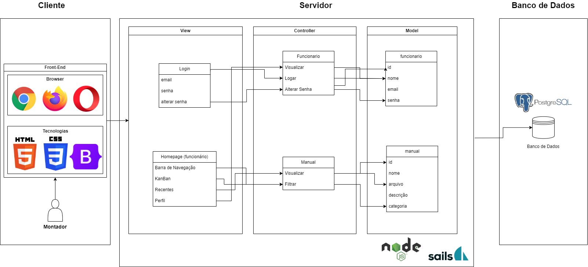
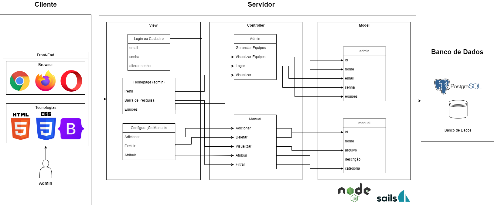

# Arquitetura MVC - Projeto DELL

&nbsp;&nbsp;&nbsp;&nbsp;No âmbito do desenvolvimento web, a arquitetura MVC é frequentemente utilizada para estruturação de um projeto. A divisão de responsabilidades proporcionada na arquitetura auxilia na organização do código, facilita a sua manutenção e permite que diferentes partes da aplicação sejam desenvolvidas independentemente umas das outras.

&nbsp;&nbsp;&nbsp;&nbsp;Em minha aplicação, separei nossa arquitetura entre a perspectiva do Admin e Montador, para facilitação da visualização.

&nbsp;&nbsp;&nbsp;&nbsp;Vejamos a estrutura desta arquitetura:

# Model

O Model representa a camada de dados da aplicação, com interação direta com o banco de dados da aplicação. Portanto, é responsável por armazenar, recuperar e manipular os dados da aplicação.

## Model (Montador MVC)

### funcionario

* id: Identificador do funcionário (único)
* nome: Nome registrado do funcionário
* email: Email institucionado vinculado ao funcionário
* senha: Senha vinculada à conta do funcionário

### manual

* id: Identificador do manual (único)
* nome: Nome atribuído ao manual
* arquivo: Arquivo vinculado ao Id do manual
* categoria: Categoria atribuída ao manual

## Controller (Montador MVC)

### Funcionario

* visualizar: Exibe o perfil do usuário na plataforma
* logar: Valida informações do usuário
* alterar senha: Altera senha vinculada ao Id do usuário no Banco de Dados

### Manual

* visualizar: Apresenta o arquivo vinculado ao Id selecionado pelo usuário
* filtrar: Filtra os manuais a serem visualizados por categoria

## View (Montador MVC)

### Login

Apresenta três campos para interação do usuário:

* email: Campo para input do email

* senha: Campo para input da senha

* alterar senha: Campo para inicialização da lógica de alteração de senha

### Homepage (funcionário)

Apresenta algumas funcionalidades e informações ao usuário:

* Barra de Navegação: Campo para filtragem de manuais pelo usuário

* KanBan: Tela para filtragem dos manuais a serem estudados pelo usuário

* Recentes: Campo para visualização dos manuais recentes abertos pelo usuário

* Perfil: Botão que apresenta o perfil do usuário

Seguimos para a visualização das funcionalidades de Admin na arquitetura MVC:

## Model (Admin MVC)

### admin

* id: Identificador do Admin (único)
* nome: Nome registrado do Admin
* email: Email institucionado vinculado ao Admin
* senha: Senha vinculada à conta do Admin
* equipes: Setores sob gerenciamento do Admin

### manual

* id: Identificador do manual (único)
* nome: Nome atribuído ao documento
* arquivo: Arquivo vinculado ao Id do manual
* categoria: Categoria do Hardware definida pela Dell

## Controller (Admin MVC)

### Admin

* Gerenciar Equipes: Acessa as equipes assinadas ao Admin
* Visualizar Equipes: Visualiza as equipes assinadas ao Admin
* Logar: Autentica as informações do Admin para login
* Visualizar: Visualiza o perfil do Admin

### Manual

* Adicionar: Adiciona novos manuais à plataforma
* Deletar: Deleta manuais da plataforma
* Visualizar: Permite que o Admin visualize manuais pesquisados
* Atribuir: Vincula um manual à um funcionário específico
* Filtrar: Filtra os manuais pesquisados por categoria

## View (Admin MVC)

### Login

Apresenta três campos para interação do usuário:

* email: Campo para input do email

* senha: Campo para input da senha

* alterar senha: Campo para inicialização da lógica de alteração de senha

### Homepage (Admin)

Apresenta algumas funcionalidades e informações ao usuário:

* Perfil: Botão que apresenta o perfil do usuário

* Barra de Pesquisa: Campo para pesquisa de manuais por nome

* Recentes: Campo para visualização das equipes em sua gerência

